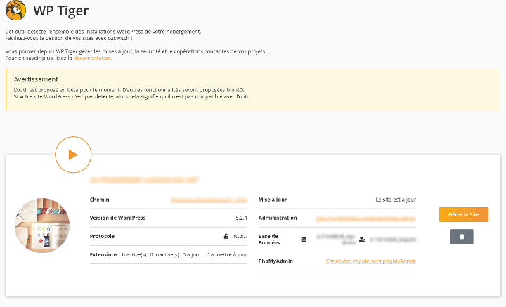

---

# WPTiger par o2switch 

---

<!--
_backgroundColor: #123
_color: #fff
-->

## <!--fit--> Petit tour du propriétaire 

---

<!--
_backgroundColor: #123
_color: #fff
-->

### WPTiger permet :
* De voir en un clin d'oeil, les infos de son site WP
* La gestion des utilisateurs (MdP, Rôle, créer un nouveau compte ...)
* Gestion des extensions (Activation/Désactivation, Supression)
* Sécurité avec les régles *htaccess* et des *snippets*
* Sauvegarde et clône du site
* Gestion du SSL
* Créer une pré-production & Actions avancées sur la BDD
---

<!--
_backgroundColor: #123
_color: #fff
-->

## <!--fit--> Démo !

---
## Crédits

* [Doc de WPTiger](https://faq.o2switch.fr/hebergement-mutualise/tutoriels-cpanel/wptiger)
* [Dépôt de cette présentation](https://github.com/Picus13/aixpress-backup)
License : [WTFPL](https://choosealicense.com/licenses/wtfpl/)

